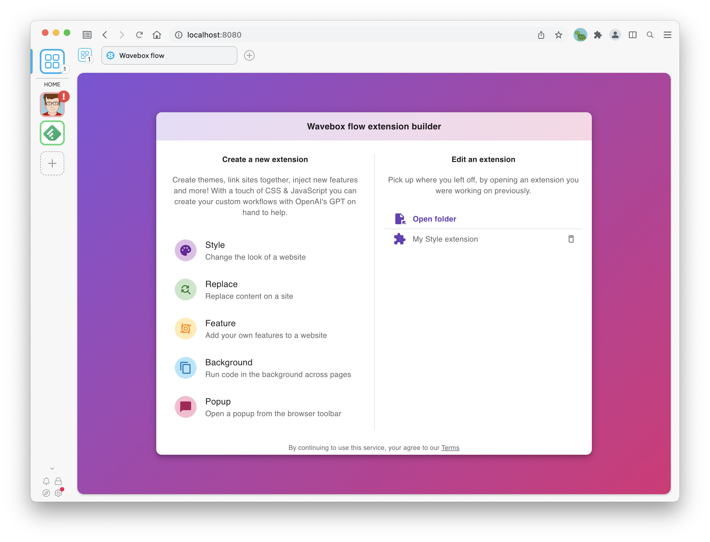

# Wavebox Flow

Wavebox flow is a tool that allows you to easily create browser extensions from within your browser. Flow includes helpful templates to get started and a ChatGPT Assistant that can give you hints and tips, complete bits of code and find errors. Without much coding experience, you can give sites superpowers, make Twitter pink or replace every instance of "duck" with "quack".

Wavebox flow is build completely on web technologies and runs right in your browser, and the extensions you create work in any Chromium browser & Firefox! If you're using [Wavebox](https://wavebox.io) to create your flows, then there are some extra helpers available to load, reload & manage your creations to make everything super simple 🦸.

## Getting started

Visit [https://flow.wavebox.io/](https://flow.wavebox.io) in your browser and pick what kind of flow you want to create. Use the helpful templates and the GTP AI Assistant to create your first extension.

If you're using Wavebox, then everything is taken care of from here, your extension is automatically installed and reloaded as you make changes 👍. If you're using another browser you need to do the following steps to install & reload your extension...

1. Open browser extension settings: **Open a new tab**, type *chrome://extensions* into the address bar and **press enter**
2. Enable developer mode: Enable the **developer mode toggle** in the top right of the extensions page
3. Load your extension: Press the **Load unpacked** button and use the file picker to locate your extension on your machine
4. Reload your changes: Use the **reload button** at any time on the extensions page whenever you want to see your changes reflected in the browser

## Building from source

Flow is built on web technologies, the majority of the codebase is written in [TypeScript](https://www.typescriptlang.org/) and [React](https://reactjs.org/). The flows that you created are stored on your machine, and flow makes heavy use of the [Web FileSystem APIs](https://developer.mozilla.org/en-US/docs/Web/API/FileSystem) to achieve this.

Building the client is as simple as...

1. `npm i`
2. `npm run watch`
3. Visit `http://localhost:8080` in your browser 👍

You can easily run the ChatGPT assistant from your local machine with your own [OpenAI](https://openai.com/) API key. To do this...

1. Edit `demo_bot_server/index.js` and place your OpenAI API key at the top of the file
2. Run `node demo_bot_server/index.js` to start the server
3. Edit `BOT_WEBSOCKET_URL` in `src/constants.ts` to point to `ws://localhost:443/`
4. Run `npm run watch` to compile and run the client
